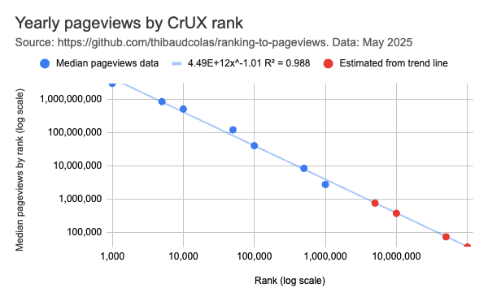

# Ranking to pageviews

An attempt at extrapolating likely pageview counts based on website rankings in the [CrUX](https://developer.chrome.com/docs/crux) and [Tranco](https://tranco-list.eu/) datasets. Pageview data comes from [analytics.usa.gov](https://analytics.usa.gov/).

## Data sources

| Source                                          | Description                                                                    | Last updated |
| ----------------------------------------------- | ------------------------------------------------------------------------------ | ------------ |
| [analytics.usa.gov](https://analytics.usa.gov/) | Top hostnames, 30 days (10k websites)                                          | 2025-06-02   |
| [Tranco](https://tranco-list.eu/)               | "latest list", 30 days (1M websites)                                           | 2025-06-02   |
| [CrUX](https://developer.chrome.com/docs/crux)  | [Cached Chrome Top Million Websites](https://github.com/zakird/crux-top-lists) | 2025-05-14   |

## Results

|       CrUX Rank | Pageviews (median) | Extrapolated |
| --------------: | -----------------: | -----------: |
|           1,000 |      3,011,800,128 |              |
|           5,000 |        857,927,585 |              |
|          10,000 |        513,925,396 |              |
|          50,000 |        121,969,002 |              |
|         100,000 |         40,783,823 |              |
|         500,000 |          8,542,119 |              |
|       1,000,000 |          2,793,260 |              |
|       5,000,000 |                    |      769,638 |
|      10,000,000 |                    |      382,161 |
|      50,000,000 |                    |       75,212 |
| Unranked (100M) |                    |       37,346 |

5M, 10M, 50M, "unranked" 100M values extrapolated based on a power series trend line of `4.49E+12x^-1.01`. R² = 0.988.

Google Sheets formula: `=4.49 * POWER(10 , 12) * A1^(-1.01)`

View the data in Google Sheets: [CrUX rank to pageviews](https://docs.google.com/spreadsheets/d/14kjXr9clXqH4mEhXpkutlUTkNtJrb0OxX8VaQMoEHVA/edit?gid=0#gid=0)

[](./yearly-pageviews-by-crux-rank.png)

The above results are based on CrUX ranks only. Tranco ranks results are shared below for reference.

## Methodology

With [DuckDB](https://duckdb.org/):

```sql
create table tranco as select * from './tranco-top-1m.csv';
create table analytics as select * from './top-10000-analytics-30d.csv';
create table crux as select * from './crux-current.csv';
create table mapping as (
  select
    a.hostname,
    crux.origin as crux_origin,
    column1 as tranco_domain,
    a.pageviews,
    a.visits,
    rank as crux_rank,
    column0 as tranco_rank,
  from analytics a
  -- CrUX has full origins including protocol. Analytics data uses domain only.
  join crux on a.hostname = regexp_extract(crux.origin, '^(?:https?:\/\/)?([^\/]+)', 1)
  -- Tranco has a tendency to use root domains even for sites served on www.
  left join tranco on regexp_extract(a.hostname, '^(?:www\.)?(.+)', 1) = tranco.column1
  order by rank asc
);
copy(select * from mapping) to './crux-tranco-analytics-mapping.csv';
```

## CrUX full results

Pageview scores are given for 365 days.

| crux_rank | min_pageviews | max_pageviews | median_pageviews | avg_pageviews | count |
| --------: | ------------: | ------------: | ---------------: | ------------: | ----: |
|      1000 |    1122257373 |    4901342883 |       3011800128 |    3011800128 |     2 |
|      5000 |         57585 |    3190859078 |        857927585 |    1262516310 |    11 |
|     10000 |     108382857 |     845000039 |        513925396 |     459828372 |     8 |
|     50000 |       2717766 |    1731045606 |        121969002 |     188932971 |    50 |
|    100000 |          8809 |    4140446789 |         40783823 |     133256552 |    56 |
|    500000 |          1691 |    1367230152 |          8542119 |      24123590 |   290 |
|   1000000 |          2798 |      78538826 |          2793260 |       4858734 |   233 |

```sql
select
    crux_rank,
    cast(round(min(pageviews * 365.0 / 30.0)) as bigint) as min_pageviews,
    cast(round(max(pageviews * 365.0 / 30.0)) as bigint) as max_pageviews,
    cast(round(median(pageviews * 365.0 / 30.0)) as bigint) as median_pageviews,
    cast(round(avg(pageviews * 365.0 / 30.0)) as bigint) as avg_pageviews,
    count(pageviews) as count
from
    mapping
group by
    crux_rank
order by
    crux_rank;
```

## Tranco full results

TODO: describe results and pitfalls.

```sql
copy (
  select
      tranco_domain,
      tranco_rank,
      cast(round(pageviews * 365.0 / 30.0) as bigint) as pageviews_365,
      crux_rank
  from
      mapping
  where
    tranco_rank not null
  order by
      tranco_rank
) to './tranco-pageviews.csv';
```

## Caveats

- CrUX ranks origins (including protocol and full), while Tranco ranks hostnames.
- Only 650 data points are available, 80% of which are for the 500k/1M ranks.
- The date ranges differ, so the site traffic reflected in the ranks and page views are for different time periods.
- The pageviews dataset is for websites primarily intended for a USA audience, while the rankings are global.
- Yearly pageview data is extrapolated from a specific 30-day period so will show seasonal patterns relevant for North America.
- There is no data for CrUX ranks above 1M (5M, 10M, 50M).

## Get the data

```bash
# Manually get tranco data from https://tranco-list.eu/.
wget https://analytics.usa.gov/data/live/top-10000-domains-30-days.csv
grep -E 'hostname,pageviews,visits|\.gov|\.mil' top-10000-domains-30-days.csv > top-10000-analytics-30d.csv
rm top-10000-domains-30-days.csv
wget https://raw.githubusercontent.com/zakird/crux-top-lists/main/data/global/current.csv.gz
extract current.csv.gz
mv current.csv crux-current.csv
```

## License

License: public domain dedication ([CC0 1.0](https://creativecommons.org/publicdomain/zero/1.0/)).
