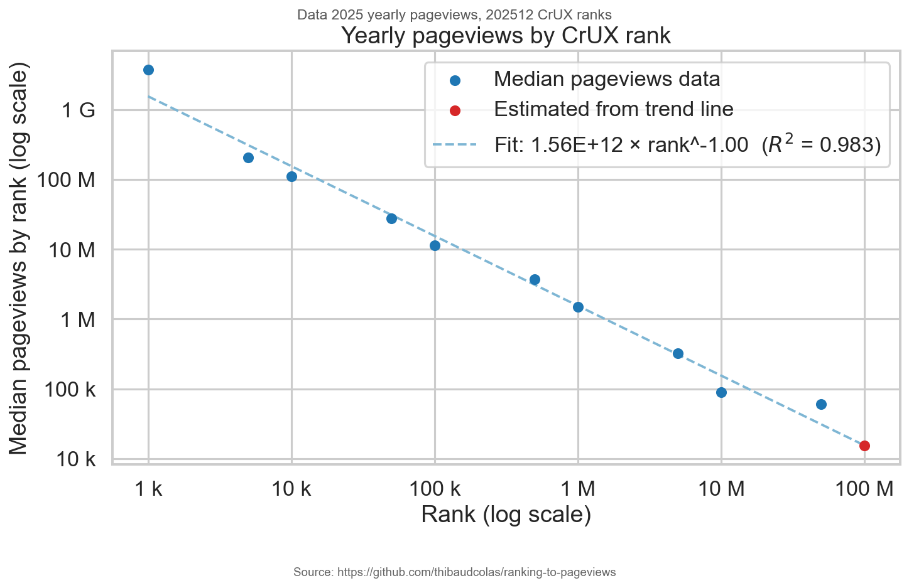

# Ranking to pageviews

Extrapolating analytics pageview counts based on website rankings in the [CrUX](https://developer.chrome.com/docs/crux) and [Tranco](https://tranco-list.eu/) datasets. Pageview data comes from [analytics.usa.gov](https://analytics.usa.gov/), the U.S. Federal Government Website and App Analytics.

## Results

|       CrUX Rank | Pageviews (median) |
| --------------: | -----------------: |
|           1,000 |      3,708,318,966 |
|           5,000 |        207,920,905 |
|          10,000 |        110,544,239 |
|          50,000 |         27,896,423 |
|         100,000 |         11,373,727 |
|         500,000 |          3,695,806 |
|       1,000,000 |          1,500,611 |
|       5,000,000 |            319,711 |
|      10,000,000 |             89,538 |
|      50,000,000 |             60,304 |
| Unranked (100M) |             15,482 |

The "unranked" 100M value is extrapolated based on a power law: 1.559E+12 × rank^-1.0004, R²: 0.9832.

Google Sheets formula: `=1.559 * POWER(10 , 12) * A1^(-1.0004)`

View the data in Google Sheets: [CrUX rank to pageviews](https://docs.google.com/spreadsheets/d/14kjXr9clXqH4mEhXpkutlUTkNtJrb0OxX8VaQMoEHVA/edit?gid=0#gid=0)

## Data sources

| Source                                          | Description                          | Last updated             |
| ----------------------------------------------- | ------------------------------------ | ------------------------ |
| [analytics.usa.gov](https://analytics.usa.gov/) | Top hostnames, 2000 websites         | 2025-01-01 to 2025-12-31 |
| [Tranco](https://tranco-list.eu/)               | "latest list", 30 days (1M websites) | December 2025            |
| [CrUX](https://developer.chrome.com/docs/crux)  | 15M+ records from                    | December 2025            |

See the [contributing documentation](./CONTRIBUTING.md) for details about the methodology.

## Caveats

- CrUX ranks origins (including protocol and full), while Tranco ranks hostnames.
- The date ranges differ, so the site traffic reflected in the ranks and page views are for different time periods.
- The pageviews dataset is for websites primarily intended for a USA audience, while the rankings are global.

## License

License: public domain dedication ([CC0 1.0](https://creativecommons.org/publicdomain/zero/1.0/)).
