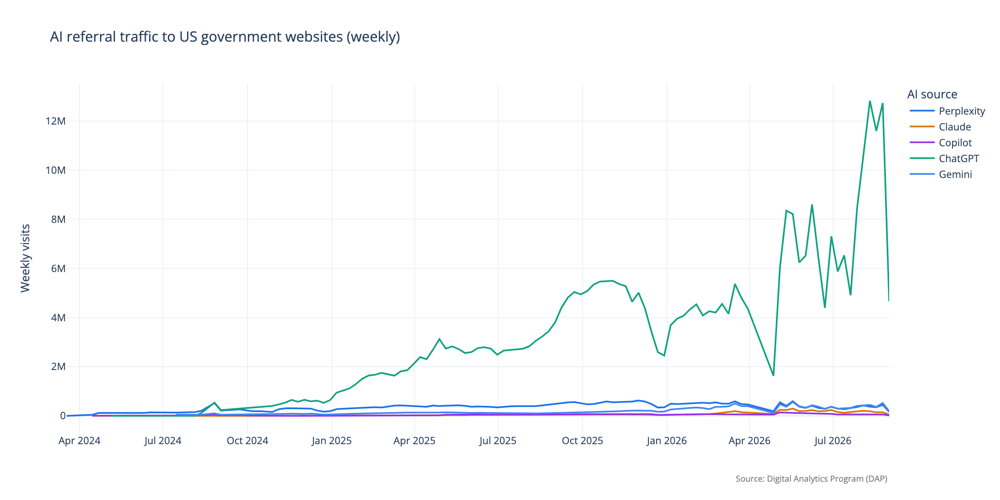
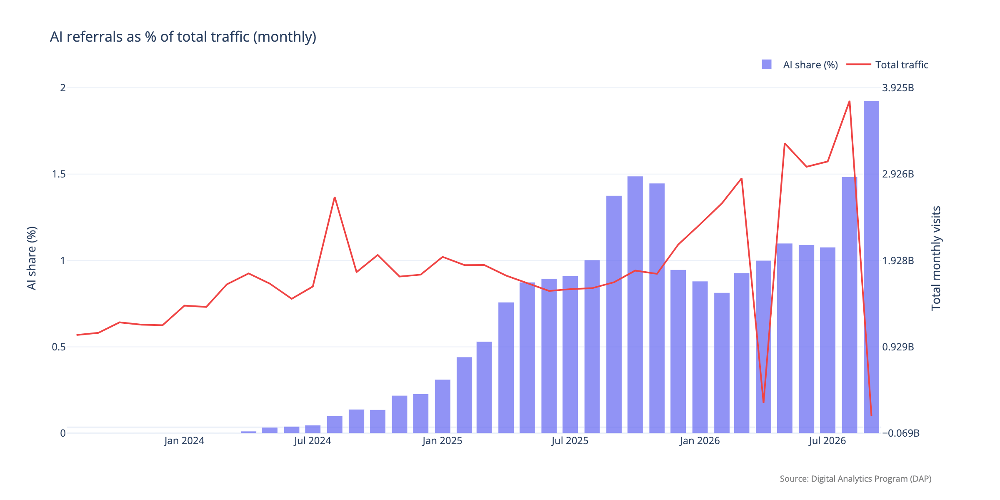
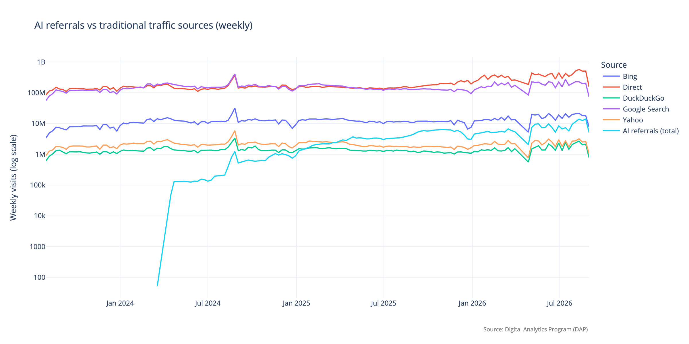
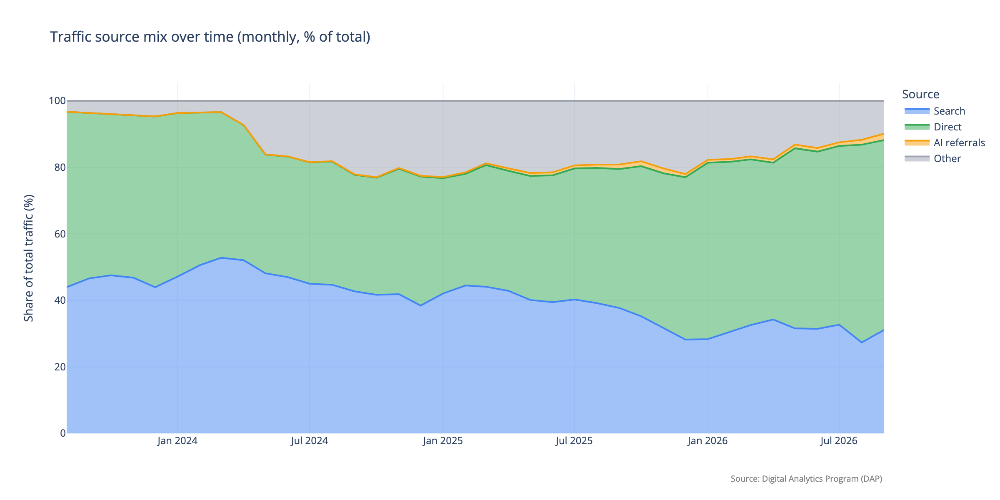

# AI Referrals to US Government Websites

How much traffic do AI assistants (ChatGPT, Perplexity, Claude, Gemini, Copilot, Grok, DeepSeek…) send to US government websites? This project tracks the answer over time, using public data from the [Digital Analytics Program (DAP)](https://analytics.usa.gov/) — the analytics platform behind [analytics.usa.gov](https://analytics.usa.gov/), covering thousands of federal websites.

## Read the analysis

**→ [`REPORT.md`](REPORT.md)** — key findings, tables, and charts.

Headline numbers as of August 2026 (latest complete month):

- AI referrals are **1.49%** of total traffic to DAP sites (56M visits in August 2026).
- They have grown **+311%** between complete quarters (2025Q1 → 2026Q2).
- That is roughly **26% of the traffic Bing sends** — from essentially zero in early 2024.

All figures are computed over complete months only; the in-progress month and the handful of days missing from the API are excluded (see the report's "Data coverage" section).

## Charts

[](./REPORT.md)

[](./REPORT.md)

[](./REPORT.md)

[](./REPORT.md)

## How it works

A single script, [`ai_referrals.py`](ai_referrals.py), fetches daily traffic-source data from the [DAP API](https://open.gsa.gov/api/dap/), stores it in a DuckDB database (with a Git LFS-backed parquet copy), and regenerates the report and charts. Re-runs only fetch missing days, so they take seconds.

## Running it

```bash
# Free API key: https://api.data.gov/signup/
export GSA_API_KEY=your_key_here
./ai_referrals.py
```

Requires [uv](https://docs.astral.sh/uv/) and Python 3.12+ (dependencies are declared inline via PEP 723).

Setup details, the data pipeline, Git LFS handling, and data caveats are documented in [`CONTRIBUTING.md`](CONTRIBUTING.md).
